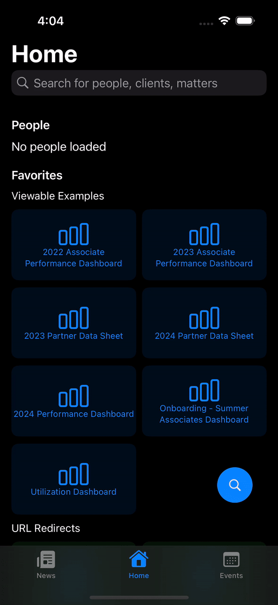
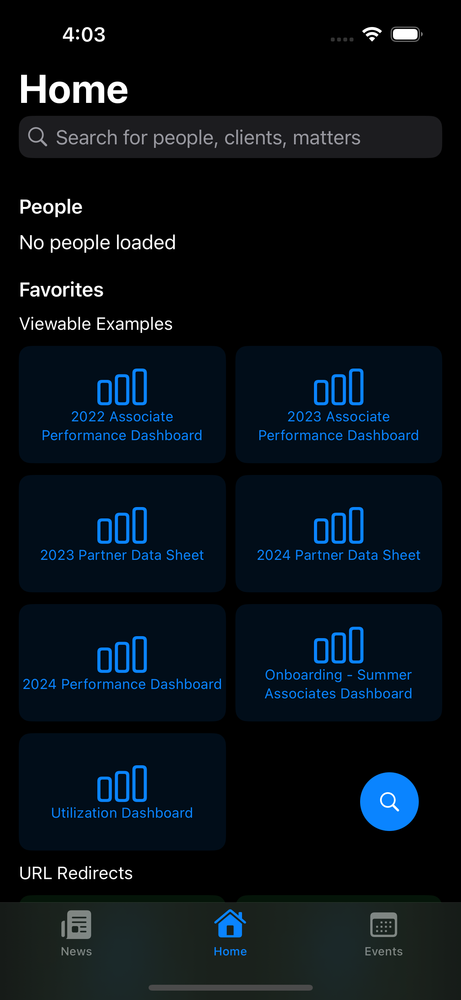
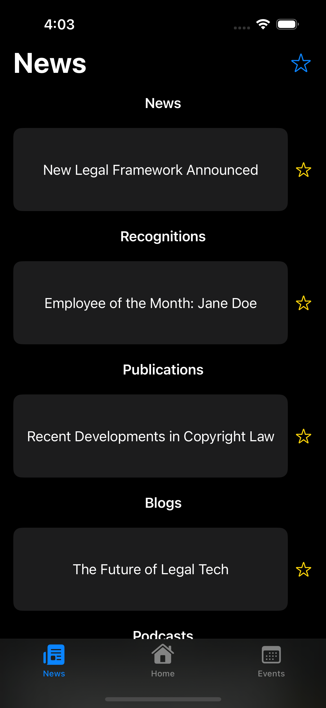
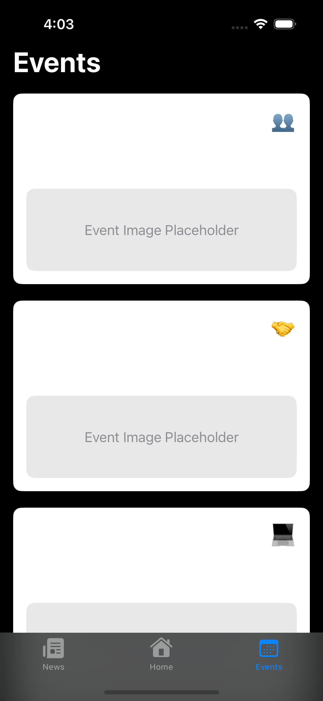

# Spark - Intranet Prototype Built in Native Swift for iOS 

<p align="center">
  <a target="_blank" href='https://developer.apple.com/swift/'></a>
  <a target="_blank" href='https://developer.apple.com/swiftui/'></a>
  <a target="_blank" href='https://cocoapods.org/'></a>
  <a target="_blank" href='https://developer.apple.com/xcode/'></a>
</p>


Screenshots
-----------










## Overview

**Spark** is a native iOS application prototype developed as a proof of concept for my internship at **Jenner & Block**. This app serves as a hub for accessing public data from the official [Jenner.com](https://www.jenner.com) website, allowing users to view people, news, and events. None of the information in this application is proprietary, commercial, or privately owned. All information is publicly available on the Jenner & Block website.

This project was created to showcase how iOS applications can interact with web-based content, using modern technologies such as Swift and SwiftUI.

## Features

- **Home Screen**: Displays favorite links, quick links, and people.
- **News Section**: Presents a list of news items.
- **Events Section**: Shows upcoming events with additional details.
- **Search Functionality**: Allows users to search for people, matters, and quick links.

## Requirements

- macOS Ventura 13.0 or later
- Xcode 14.0 or later
- iOS 16.0 or later

## Project Setup

To get started with the project, follow these steps:

### 1. Clone the Repository

```
git clone https://github.com/yourusername/spark-ios-app.git
cd spark-ios-app
```

### 2. Install Dependencies

Make sure you have **CocoaPods** installed on your system. If you don't have it, install it using the following command:

```
sudo gem install cocoapods
```
Next, install the dependencies by running the following command inside the project directory:

```
pod install
```

### 3. Open the Project in Xcode
After installing the dependencies, open the Xcode workspace:

```
open Spark.xcworkspace
```

### 4. Build and Run
Select the target device (either a simulator or a physical iPhone), and click on the **Run** button in Xcode to build and launch the app.

License & Disclaimer
-------

This project is licensed under the MIT License. See the LICENSE file for more details. This project was developed as a prototype for educational and demonstration purposes only. All data is publicly available from the [Jenner & Block](https://www.jenner.com) website.
